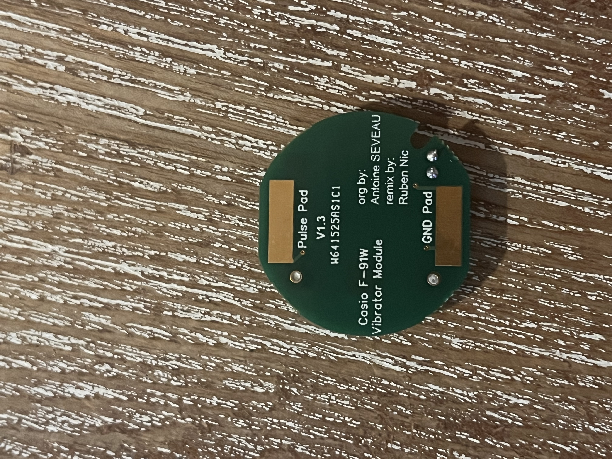

## Casio f-91w

Collection of casio f-91w projects and files

# Casio Vibration Module

Vibration Module that fits behind the internal casio f-91w circuit board

## TODO

1. Fix the resister from 1k to 100k in the gerbers

### BOM

| Items # | Ref Des              | Qty | Manufacturer          | Mfg Part #         | Description                                                         | Package | Type         |
| ------- | -------------------- | --- | --------------------- | ------------------ | ------------------------------------------------------------------- | ------- | ------------ |
| 1       | D1                   | 1   | Diotec Semiconductor  | SK14               | Schottky Diodes & Rectifiers Schottky, SMA, 40V, 1A                 | Reel    | SMD          |
| 2       | C1                   | 1   | KEMET                 | C0805C226M9PAC7800 | Multilayer Ceramic Capacitors MLCC - SMD/SMT 6.3V 22uF X5R 0805 20% | Reel    | SMD          |
| 3       | R1                   | 1   | TT Electronics        | WCR0805LF1003FPLT  | Thick Film Resistors - SMD 100K OHM 1%                              | Reel    | SMD          |
| 4       | MOSFET               | 1   | Infineon Technologies | IRLML2803TRPBF     | MOSFET MOSFT 30V 1.2A 250mOhm 3.3nC LogLvl                          | Reel    | SMD          |
| 5       | CR1225               | 1   | Keystone Electronics  | 3000               | Coin Cell Battery Holders SM COIN CELL BH 12mm                      | Bulk    | SMD          |
| 6       | Vibration Motor      | 1   | SparkFun              | ROB-08449          | Dia 10mm x 3.4mm Coin Type Vibration Motor - 3V                     | Bulk    | Through-Hole |
| 7       | Inserted into CR1225 | 1   | Renata                | CR1225.IB          | Coin Cell Battery 3V 12.5 x 2.5mm Ind Bulk Pkging                   | Bulk    | Inserted     |

